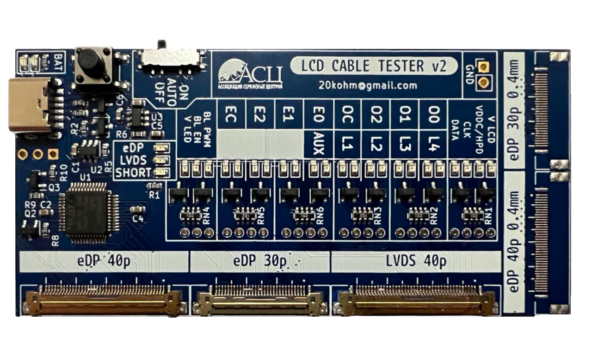



 English: <a title="English" href="README.md">

# ТЕСТЕР ШЛЕЙФОВ МАТРИЦ НОУТБУКОВ  

## Описание
Тестер предназначен для проверки целостности шлейфов LVDS и eDP, используемых в распространенных ноутбуках. Поддерживаются только шлейфы с стандартной цоколевкой.

Тестер позволяет определить поврежденные проводники путём механического воздействия на шлейф.
Также тестер позволяет определить наличие коротких замыканий в шлейфе.
Тестер подключается к шлейфу вместо матрицы.
Для диагностики обрывов требуется подключение к материнской плате ноутбука. 
Проверка на наличие коротких замыканий выполняется без подключения к МП.
___
__При использовании тестера, материнская плата должна быть откючена от источника питания и батареи!__
___

## Руковдство
- [Руководство v2](./docs/LCD_CABLE_TESTER_V20_RU.pdf)  
- [Руководство v0.3](./docs/LCD_CABLE_TESTER_V03_RU.pdf)
- [User manual  v2 English](./docs/LCD_CABLE_TESTER_V20_EN.pdf)  
- [User manual  v0.3 English](./docs/LCD_CABLE_TESTER_V03_EN.pdf)  
